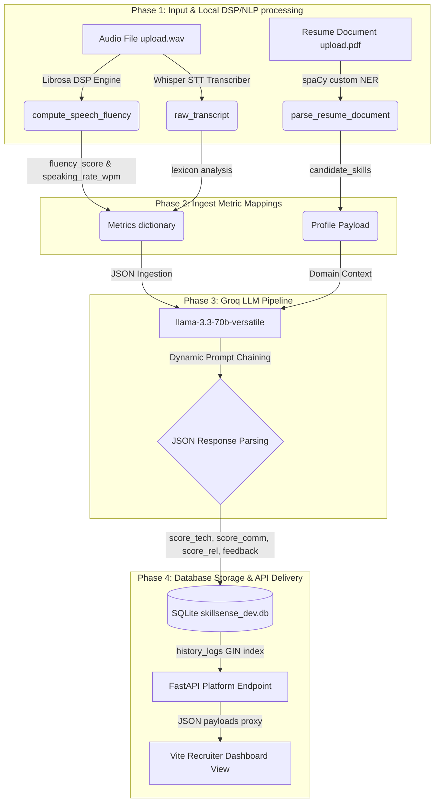

# SkillSense AI: Groq & Local Libraries Data Flow Integration Specification

This document details the architectural mapping, schemas, and continuous data flow connectivity between local Python processing libraries (Librosa, NumPy, spaCy), the Groq AI service, and the SQLite relational database. This blueprint ensures that all pipeline components are aligned in a predefined, perfect manner.

---

## 1. End-to-End Data Integration Architecture

The following diagram illustrates how raw candidate submissions (acoustic speech, resume documents) flow through local DSP/NLP engines, map to Groq LLM ingestion payloads, and persist securely in the SQLite database to drive the Vite-powered Recruiter Dashboard.



---

## 2. Local Processing Libraries & Metrics Extraction

To maintain high data integrity and reliability, the backend combines specialized digital signal processing (DSP) and natural language processing (NLP) libraries locally before triggering any external LLM request.

### A. Speech Fluency Analytics (Librosa & NumPy)
The `AudioProcessingEngine` ingests audio recordings (`.wav`, `.mp3`) and computes acoustic parameters:
* **Audio Duration (`audio_duration_sec`)**: Computed via `librosa.get_duration(y=y, sr=sr)`.
* **Silent Pause Count (`pause_count`)**: Computed using a Short-Time Energy threshold (`-40 dB` default) and frame-level energy metrics. Frame durations are calculated dynamically based on sample rates and hop-lengths.
* **Speaking Rate (`speaking_rate_wpm`)**: Calculated using the total words in the transcript divided by the acoustic audio duration.
* **Filler Word Ratio (`filler_ratio`)**: Derived by checking the transcript against a local filler lexicon (`um`, `uh`, `like`, `so`, `actually`, `basically`).
* **Fluency Score (`fluency_score`)**: A composite, normalized index (0.0 to 10.0) calculated as:
  $$\text{Fluency Score} = (0.4 \times \text{wpm\_score}) + (0.3 \times \text{filler\_penalty}) + (0.3 \times \text{pause\_penalty})$$

### B. Profile Entity Extraction (spaCy & en_core_web_sm)
The `EnterpriseResumeParser` extracts metadata from uploaded documents:
* **Taxonomy Ruler Matching**: A pipeline ruler matches industry taxonomy terms (e.g. Python, AWS, Docker, Kubernetes) under the unified label `SKILL`.
* **Regex Extractors**: Cleans text streams and extracts phone numbers and emails to build candidate database fields.

---

## 3. Groq Ingestion Payload & Prompt Schema Mapping

Once local metrics are computed, they are packaged into a structured dictionary and mapped to the Groq Llama-3 API prompts.

### A. Request Payload Structure (Input Schema)
The input schema mappings translate local computational states into Groq-understandable prompt parameters:

| Local Python Variable | Groq Prompt Variable | Type | Purpose |
| :--- | :--- | :--- | :--- |
| `domain` | `Candidate Domain` | `string` | Defines the hiring focus (e.g. AI/ML, Cloud) |
| `question_text` | `Question` | `string` | The assessment question presented to candidate |
| `raw_transcript` | `Transcript` | `string` | Spoken response text transcribed via audio STT |
| `metrics["speaking_rate_wpm"]` | `Words Per Minute` | `float` | Speech rate indicator for communication grading |
| `metrics["fluency_score"]` | `Voice Fluency Index` | `float` | Local speech fluency index graded out of 10 |

### B. Groq LLM API Configuration
* **Endpoint Model**: `llama-3.3-70b-versatile` (Optimized for lightning-fast latency and structural instruction following).
* **System Directive**: `"You are an expert technical interviewer grading a candidate's spoken response. Output valid JSON only."`
* **Temperature Setting**: `0.3` (Balances creative evaluation depth with structural output reproducibility).

---

## 4. Groq Response JSON Schema & SQLite Field Mapping

Groq generates structural JSON objects containing analytical grades and summaries. The backend dynamically extracts and parses these keys to save them directly in the relational tables.

### A. Output Response JSON Schema
The parsed response from `GroqAIService.grade_response` must strictly align to this format:

```json
{
  "score_tech": 8.5,
  "score_comm": 9.0,
  "score_rel": 8.0,
  "feedback": "Candidate demonstrated exceptional grasp of database replication concepts, addressing connection scaling limitations cleanly. Speech rate is clear and professional."
}
```

### B. Database Integration: SQLite `history_logs` Column Mapping
To support flexible, schema-agnostic candidate session logs, the SQLite database table `interview_sessions` contains a dedicated `history_logs` column. The backend converts candidate responses, Librosa metrics, and Groq JSON outputs into a nested list and serializes it:

```json
[
  {
    "question_number": 1,
    "question": "Explain standard database scaling constraints when migrating from local monolithic models to cloud instances.",
    "transcript": "We can use read replicas to handle high read workloads and sharding to distribute writes.",
    "speech_metrics": {
      "audio_duration_sec": 42.50,
      "speaking_rate_wpm": 130.50,
      "pause_count": 2,
      "filler_words_count": 1,
      "filler_ratio": 0.0238,
      "fluency_score": 8.85
    },
    "grades": {
      "score_tech": 8.50,
      "score_comm": 9.00,
      "score_rel": 8.00,
      "feedback": "Candidate demonstrated exceptional grasp of database replication concepts..."
    }
  }
]
```

### C. SQLite Relational Schema Mapping Table

| SQLite Column (Table: `interview_sessions`) | Nested JSON Key | Data Type | Source Provider |
| :--- | :--- | :--- | :--- |
| `history_logs` | `question` | `TEXT` | `FastAPI Platform Router` |
| `history_logs` | `transcript` | `TEXT` | `Speech-to-Text Transcriber` |
| `history_logs` | `speech_metrics` | `JSON Object` | `AudioProcessingEngine (Librosa)` |
| `history_logs` | `grades` | `JSON Object` | `GroqAIService (Llama-3 LLM)` |
| `history_logs` | `grades.score_tech` | `NUMERIC (float)` | `Groq graded Technical Skill` |
| `history_logs` | `grades.score_comm` | `NUMERIC (float)` | `Groq graded Communication skill` |
| `history_logs` | `grades.score_rel` | `NUMERIC (float)` | `Groq graded Relevance & Demeanor` |

---

## 5. Continuous Data Flow Continuity Checklist

To audit that data flows continuously and that connections are fully aligned without pipeline breakages, verify the following check sequence:

- [ ] **Dependency Alignment Check**: Ensure `librosa`, `numpy`, `spacy`, and `groq` are successfully imported by the python environment.
- [ ] **Voice DSP Output Alignment**: Verify `AudioProcessingEngine.compute_speech_fluency` computes all expected keys (`speaking_rate_wpm`, `fluency_score`) without throwing runtime division errors.
- [ ] **Ingestion Mapping Alignment**: Confirm that domain context, transcripts, and calculated WPM flow correctly into the parameters of the LLM prompt.
- [ ] **API Key / Simulation Safeguard**: Ensure `GROQ_API_KEY` is recognized in `.env`, or that system fallbacks successfully generate mock evaluation objects if keys are absent.
- [ ] **JSON Parsing Resilience**: Confirm that `clean_json_payload` is stripping markdown blocks (e.g. ` ```json ` fences) safely to prevent string parsing crashes.
- [ ] **SQLite History Schema Alignment**: Verify that SQLite databases are initialized with the `history_logs` column inside `interview_sessions` to prevent transactional insert failures.
- [ ] **Frontend-to-Backend Binding**: Check that Vite proxy bindings (port `3000` targeting backend port `8000`) pass JSON arrays to the React dashboard views.

---
> [!IMPORTANT]
> This integration blueprint serves as the definitive reference specification. All components in the repository must be verified against these mapped keys and schemas to ensure absolute operational stability and alignment.
